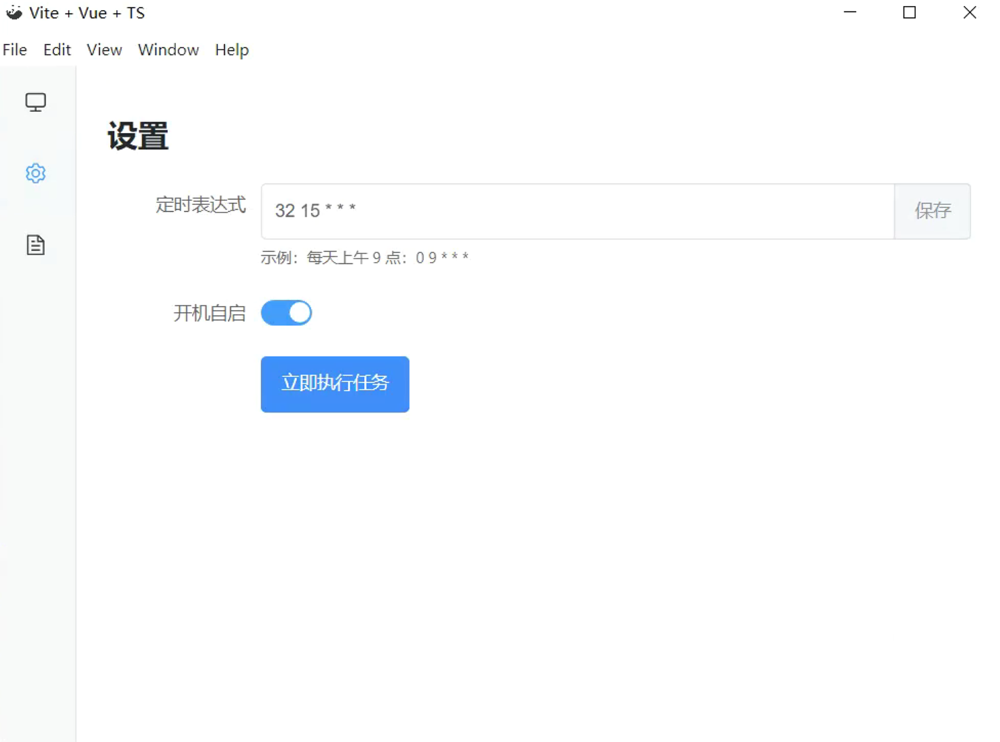
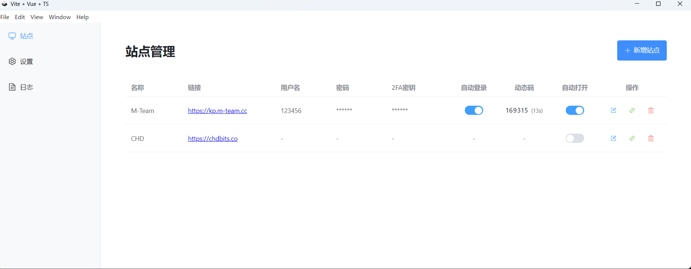

# PT Manager

一个用于定时打开 PT（Private Tracker）站点的简洁 Electron 应用，帮助保持登录状态与 Cookie 长期有效。

## 功能

- **站点管理**：新增、编辑、删除以及一键打开站点，直观管理你的 PT 站列表。
- **定时任务**：内置 Cron 调度器，支持自定义 Cron 表达式，定时自动后台打开站点。
- **日志查看**：实时记录任务执行状态，方便排查问题和确认保活情况。
- **托盘支持**：支持最小化到系统托盘，后台静默运行，可通过托盘菜单快速触发任务。
- **开机自启**：支持配置开机自动启动，确保持续保活。
- **按站点开关**：支持为每个站点单独控制是否参与定时自动打开。
- **自动登录（M-Team）**：支持自动填充账号密码并提交，遇到二次验证可自动填写 TOTP 动态码（需配置密钥），目前仅支持自动登录馒头。

## 界面预览

<div align="center">
  
  <br/><br/>
  
</div>

## 项目结构

- `electron/`：主进程代码（`store`、`scheduler`、`logger`、`tray`）
- `src/`：渲染进程代码（Vue 3 + Element Plus）
- `src/views/`：页面（Sites、Settings、Logs）

## 安装

```bash
npm install
```

## 开发运行

```bash
npm run dev
```

提示：开发模式下会跳过定时任务的自动启动，可通过设置页或托盘菜单手动运行任务。（见 `electron/scheduler.ts`）

## 构建

```bash
npm run build
```

Windows 打包：

```bash
npm run pack:win
```

## 配置与数据

应用会在用户数据目录存储配置与日志文件：

- Windows：`%APPDATA%\pt-manager\store.json`、`%APPDATA%\pt-manager\app.log`

`store.json` 字段说明：

- `cron`：Cron 表达式，默认值 `"0 9 * * *"`（每天 09:00）
- `duration`：定时任务打开站点窗口保持时长（分钟），默认 `5`
- `autoLaunch`：是否开机自启
- `sites`：站点列表（包含 `id`、`name`、`url`、`active` 等）

### 站点字段说明

每个站点对象字段示例（不同站点字段可能不同）：

- `id`：站点标识
- `name`：站点名称
- `url`：站点地址
- `active`：是否参与定时任务自动打开（默认 `true`）

M-Team 站点额外字段（用于自动登录）：

- `autoLogin`：是否启用自动登录（默认 `true`）
- `username`：账号
- `password`：密码
- `totpSecret`：二次验证密钥（支持直接粘贴 `otpauth://...` 或 `secret=...`）

## 使用指南

- 在“站点”页添加需要保活的 PT 站点
- 在“设置”页配置 Cron 表达式与开机自启
- 如需自动登录 M-Team：在站点编辑中填写账号密码，并填写 `totpSecret`（如启用二次验证）
- 通过“日志”页查看任务执行记录
- 运行中可最小化到托盘，使用托盘菜单的“运行任务”手动触发

## 许可

MIT
